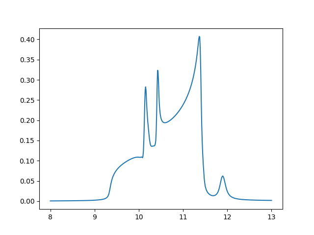

# Is it optool or is it me?

What's with the forsterite opacity curve in optool? Is it optool, or am I the problem? The expected curve from Suto+2006 is as below, followed by the curve from optool.

### In this repo

1. `outputs` contains the output `dustkappa.dat` files from optool. The commands I used to obtain the outputs are provided in line 15 of the output .dat files. 
2. `opacity.py` is the script I used to plot the opacity curves from the output files of optool.
3. `images` contain the opacity curves plotted using `opacity.py`.

### My hypotheses:

* **Fayalite and forsterite opacity files are mixed up**: At first glance, both the opacity curves look similar, and I really believed this was it. But they are not the same. See `optool_fayalite_opacity` and `optool_forsterite_opacity` in `curves`.
* **$\lambda_{min}$ causing issues**: $\lambda_{min}$ for Forsterite on the userguide is 5 $\mu m$. So what if I just use that as $\lambda_{min}$? It *does* solve the issue of the peak of Forsterite being at about 8000 $g/cm^2$ (it was previously at about 6000 $g/cm^2$), but the curve still looks weird.
* **Is it the fmaxs?**: Tried with a whole bunch of fmax values. Used 0.999 instead of 1.0 since optool doesn't seem to accept 1.0 as a possible value for the fmax. Does not help. Image below:

* **Output file all good. I plot like an idiot**: I need to cover all bases, okay? I try saving the wavelength and $K_{abs}$ using pandas and the with open file command. Both yield similar results. I also tried plotting $K_{sca}$. No bueno. 
* **Something's wrong with optool**: Dare I say I'm leaning towards this one at the moment? But of course, I am not wading through the deep, dark, mystical Fortran ocean to figure this one out.
* **It is my stupidity**: The most likely possibility. But I can't figure out what I am missing. An untestable hypothesis?
